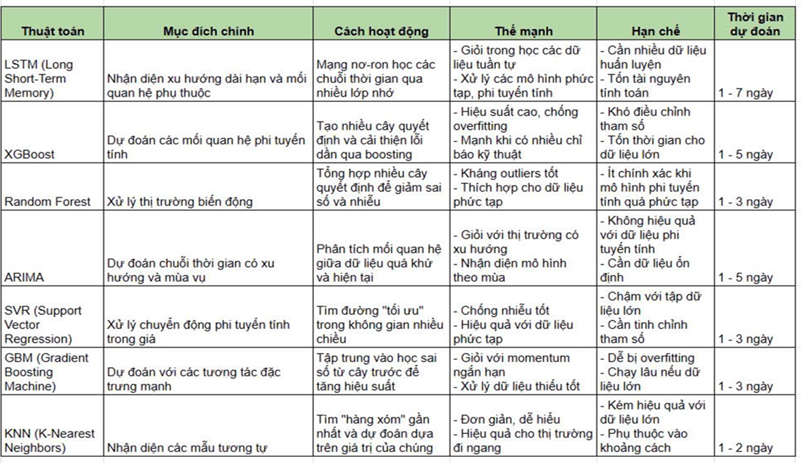
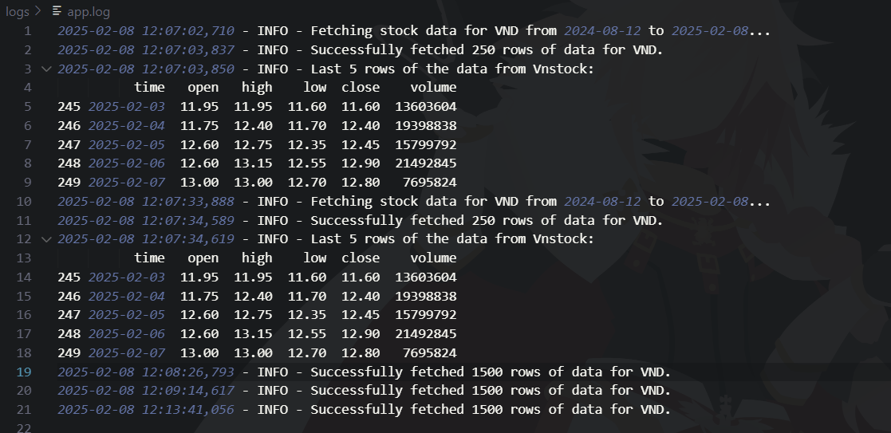
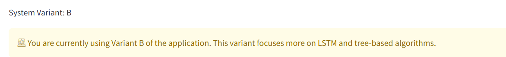
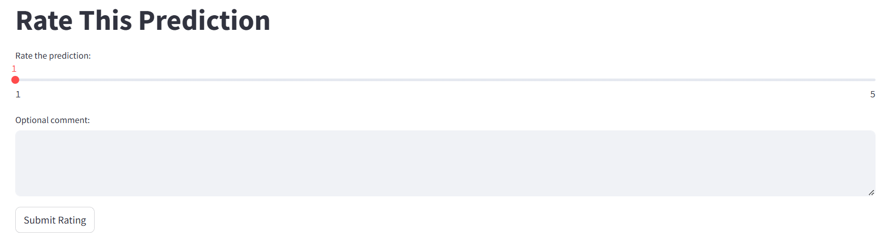
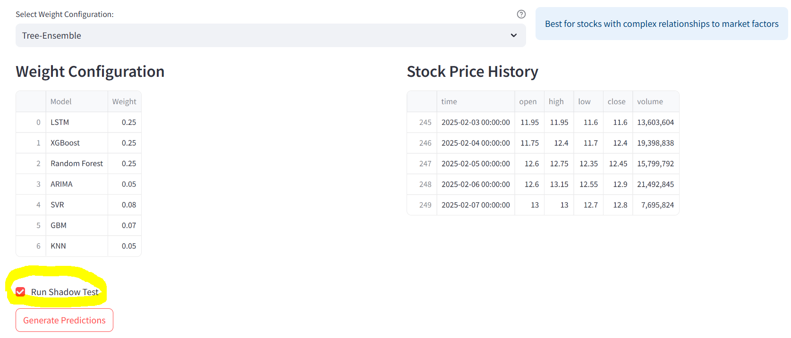

# Bộ Dự Đoán Chứng Khoán Đa Thuật Toán  

- [Bộ Dự Đoán Chứng Khoán Đa Thuật Toán](#bộ-dự-đoán-chứng-khoán-đa-thuật-toán)
  - [🚀 Tổng Quan](#-tổng-quan)
  - [✨ Tính Năng Chính](#-tính-năng-chính)
  - [⚙ Thông Số Kỹ Thuật](#-thông-số-kỹ-thuật)
    - [📊 Các Chỉ Báo Kỹ Thuật](#-các-chỉ-báo-kỹ-thuật)
    - [🤖 Các Mô Hình Dự Đoán](#-các-mô-hình-dự-đoán)
  - [🛠️ Cài Đặt & Khởi Chạy](#️-cài-đặt--khởi-chạy)
    - [🤔 Nếu bạn sử dụng UV](#-nếu-bạn-sử-dụng-uv)
    - [🐍 Cài Đặt Python 3.11](#-cài-đặt-python-311)
      - [Trên Windows (dùng winget)](#trên-windows-dùng-winget)
      - [Trên Ubuntu/Debian](#trên-ubuntudebian)
      - [Trên macOS (dùng Homebrew)](#trên-macos-dùng-homebrew)
      - [Tải các thư viện liên quan](#tải-các-thư-viện-liên-quan)
      - [Chạy Ứng Dụng](#chạy-ứng-dụng)
  - [💡 Hướng Dẫn Sử Dụng](#-hướng-dẫn-sử-dụng)
    - [Thực Hành Tốt Nhất](#thực-hành-tốt-nhất)
    - [Quản Lý Rủi Ro](#quản-lý-rủi-ro)
    - [📈 Tín Hiệu Giao Dịch](#-tín-hiệu-giao-dịch)
  - [⚠️ Hạn Chế](#️-hạn-chế)
    - [🔄 Cải Tiến Trong Tương Lai](#-cải-tiến-trong-tương-lai)
  - [🚂 Về nội dung kiểm thử và thử nghiệm trong môi trường thực tế](#-về-nội-dung-kiểm-thử-và-thử-nghiệm-trong-môi-trường-thực-tế)

## 🚀 Tổng Quan  

**Multi-Algorithm Stock Predictor** là một hệ thống dự đoán giá cổ phiếu kết hợp nhiều thuật toán học máy và các chỉ báo kỹ thuật để tạo ra dự đoán tổng hợp về biến động thị trường chứng khoán. Ứng dụng này được xây dựng bằng **Streamlit**, tích hợp 7 mô hình dự đoán khác nhau, phân tích kỹ thuật theo thời gian thực để cung cấp thông tin giao dịch toàn diện.  

## ✨ Tính Năng Chính  

- Dự đoán tổng hợp từ 7 thuật toán khác nhau  
- Tích hợp dữ liệu chứng khoán thời gian thực thông qua nguồn dữ liệu từ TCBS (**Công ty chứng khoán trực thuộc Techcombank VietNam**)
- Hiển thị trực quan các chỉ báo kỹ thuật  
- Đánh giá rủi ro và tính toán độ tin cậy  
- Phân tích sự đồng thuận giữa các mô hình  
- Giao diện web tương tác
- Đồ thị cổ phiếu  
- Tùy chỉnh khung thời gian phân tích  

## ⚙ Thông Số Kỹ Thuật

### 📊 Các Chỉ Báo Kỹ Thuật  

Hệ thống tính toán và sử dụng nhiều chỉ báo kỹ thuật để phân tích thị trường:  

- **Đường trung bình động (Moving Averages)**: 5, 20, 50, 200 ngày  
- **RSI (Chỉ số sức mạnh tương đối - Relative Strength Index)**  
- **MACD (Phân kỳ hội tụ trung bình động - Moving Average Convergence Divergence)**  
- **Dải Bollinger (Bollinger Bands)**  
- **Tốc độ thay đổi giá (ROC - Rate of Change)**  
- **Phạm vi thực trung bình (ATR - Average True Range)**  
- **Bộ dao động Stochastic (Stochastic Oscillator)**  
- **Williams %R**  
- **Phân tích khối lượng giao dịch (Volume Analysis)**  
- **Đường trung bình động hàm mũ (EMA - Exponential Moving Average)**  
- **Chỉ báo động lượng (Momentum Indicators)**  

### 🤖 Các Mô Hình Dự Đoán  

Hệ thống sử dụng 7 mô hình dự đoán, mỗi mô hình có thế mạnh riêng:  

1. **LSTM (Long Short-Term Memory)** - Trọng số mặc định: **30%**  
   - Nhận diện các xu hướng dài hạn và mối quan hệ phụ thuộc trong dữ liệu  
   - Sử dụng các lớp **bidirectional** để tăng cường khả năng học chuỗi  
   - Hiệu quả nhất trong việc nắm bắt động thái phức tạp của thị trường  
   - Thích hợp cho dự đoán **1-7 ngày**  

2. **XGBoost** - Trọng số mặc định: **15%**  
   - Xử lý tốt các mối quan hệ phi tuyến tính  
   - Hiệu suất cao với các chỉ báo kỹ thuật  
   - Chống overfitting mạnh mẽ  
   - Tối ưu cho dự đoán **1-5 ngày**  

3. **Random Forest** - Trọng số mặc định: **15%**  
   - Hoạt động tốt trong điều kiện thị trường biến động  
   - Khả năng chống nhiễu và xử lý dữ liệu ngoại lai  
   - Hiệu quả trong việc nhận diện sự thay đổi chế độ thị trường  
   - Thích hợp cho dự đoán **1-3 ngày**  

4. **ARIMA** - Trọng số mặc định: **10%**  
   - Chuyên về dự báo chuỗi thời gian  
   - Nhận diện các mô hình theo mùa  
   - Hiệu quả với thị trường có xu hướng rõ ràng  
   - Tối ưu cho dự đoán **1-5 ngày**  

5. **SVR (Support Vector Regression)** - Trọng số mặc định: **10%**  
   - Phù hợp với các biến động giá phi tuyến tính  
   - Xử lý tốt dữ liệu có chiều cao  
   - Khả năng chống nhiễu tốt  
   - Hiệu quả cho dự đoán **1-3 ngày**  

6. **GBM (Gradient Boosting Machine)** - Trọng số mặc định: **10%**  
   - Hiệu suất cao khi xử lý các đặc trưng phức tạp  
   - Nhận diện tốt động lượng của thị trường  
   - Hoạt động tốt với dữ liệu thiếu sót  
   - Thích hợp cho dự đoán **1-3 ngày**  

7. **KNN (K-Nearest Neighbors)** - Trọng số mặc định: **10%**  
   - Đơn giản nhưng hiệu quả trong việc nhận diện mẫu tương tự  
   - Tốt cho thị trường đi ngang  
   - Dự đoán dựa trên mô hình mẫu  
   - Hiệu quả nhất cho dự đoán **1-2 ngày**  

Ngoài ra, có các tùy chọn chiến lược dự đoán, cung cấp các trọng số tùy chỉnh cho mỗi mô hình. Xem thêm tại `models/weight_configurations.py`.

## 🛠️ Cài Đặt & Khởi Chạy  

### 🤔 Nếu bạn sử dụng UV

Nếu bạn đã sử dụng [UV](https://docs.astral.sh/uv/) (công cụ quản lý dự án Python, có ưu điểm là rất nhanh và nhẹ), bạn có thể khởi chạy ngay sau khi clone repo về máy và thực hiện cài đặt các thư viện cần thiết.  

```bash
uv pip install -r requirements.txt
```

Để khởi chạy ứng dụng, hãy chạy lệnh sau:  

```bash
uv streamlit run stock_predictor_main.py
```

### 🤔 Nếu bạn không dùng UV, hãy xem các hướng dẫn dưới đây.

### 🐍 Cài Đặt Python 3.11  

Trước khi cài đặt các thư viện, hãy đảm bảo rằng bạn đã cài đặt **Python 3.11**.  

#### Trên Windows (dùng winget)  

```bash
winget install Python.Python.3.11
```  

#### Trên Ubuntu/Debian  

```bash
sudo apt update
sudo apt install python3.11
```  

#### Trên macOS (dùng Homebrew)  

```bash
brew install python@3.11
```  

Sau khi cài đặt, kiểm tra phiên bản Python:  

```bash
python3.11 --version
```  

Nếu `pip` chưa được cài đặt, hãy chạy:  

```bash
python3.11 -m ensurepip
python3.11 -m pip install --upgrade pip
```  

#### Tải các thư viện liên quan

```bash
pip install -r requirements.txt
```

#### Chạy Ứng Dụng  

```bash
streamlit run stock_predictor_main.py
```  

## 💡 Hướng Dẫn Sử Dụng

### Thực Hành Tốt Nhất

- Sử dụng dữ liệu huấn luyện dài hơn (5+ năm) để có dự đoán ổn định hơn.
- Tập trung vào các cổ phiếu có thanh khoản cao và lịch sử giao dịch ổn định.
- Xem xét nhiều khung thời gian để xác nhận xu hướng.
- Luôn kết hợp dự đoán với phân tích cơ bản.
- Theo dõi điểm tin cậy của dự đoán và đánh giá rủi ro.

### Quản Lý Rủi Ro

- Sử dụng điểm tin cậy để đánh giá độ chính xác của dự đoán.
- Xem xét phạm vi dự đoán (giới hạn trên và dưới).
- Theo dõi mức độ đồng thuận giữa các mô hình.
- Kiểm tra các chỉ báo đánh giá rủi ro.
- Đánh giá tâm lý tin tức thị trường trước khi ra quyết định.

### 📈 Tín Hiệu Giao Dịch

Hệ thống tạo tín hiệu giao dịch dựa trên:

- Tỷ Lệ Thay Đổi Giá (**Price Change Percentage**)

  - Tín hiệu mạnh: Biến động dự đoán >10%
  - Tín hiệu trung bình: Biến động dự đoán 3-10%
  - Tín hiệu yếu: Biến động dự đoán 1-3%
  - Tín hiệu giữ nguyên: Biến động dự đoán <1%

- Điểm Tin Cậy (**Confidence Score**)

  - Tin cậy cao: >0.8
  - Tin cậy trung bình: 0.6-0.8
  - Tin cậy thấp: <0.6

## ⚠️ Hạn Chế  

1. Không thể dự đoán các sự kiện bất ngờ hoặc tin tức đột xuất (**black swan events**).  
2. Độ chính xác giảm trong giai đoạn thị trường biến động mạnh.  
3. Cần dữ liệu lịch sử chất lượng cao để dự đoán chính xác.  
4. Có thể không phản ánh được những thay đổi cơ bản của doanh nghiệp.  
5. Hiệu suất trong quá khứ không đảm bảo kết quả trong tương lai.  

### 🔄 Cải Tiến Trong Tương Lai  

1. Tích hợp phân tích tâm lý thị trường từ mạng xã hội (tích hợp tin tức từ các site tin tức lớn như **fireant**, **cafef**).  
2. Bổ sung các mô hình học sâu (**Deep Learning**) tiên tiến hơn.  
3. Cải thiện khả năng kỹ thuật trích xuất đặc trưng (**Feature Engineering**).  
4. Phân tích tương quan thị trường theo thời gian thực.  
5. Đề xuất tối ưu hóa danh mục đầu tư.  
6. Nhận diện chế độ thị trường (**Market Regime Detection**).  
7. Tăng cường các tính năng quản lý rủi ro.  

## 🚂 Về nội dung kiểm thử và thử nghiệm trong môi trường thực tế

- **Dữ Liệu**: Dữ liệu chứng khoán thường có nhiều biến động và không chắc chắn, do đó, việc kiểm thử và thử nghiệm trong môi trường thực tế là cần thiết. Trong dự án này, nhóm sử dụng dữ liệu chứng khoán thời gian thực từ các thư viện Python như **yfinance** (Yahoo Finance) và **vnstock** (Dữ liệu chứng khoán Việt Nam) để cung cấp dữ liệu chính xác và đáng tin cậy. Bản cài đặt chính `stock_predictor_main.py` sử dụng dữ liệu thời gian thực từ **vnstock**, trong khi bản cài đặt phụ (`misc/stock_predictor_with_yahoo.py`) sử dụng dữ liệu từ **yfinance**.


- **Mô Hình**: Với dữ liệu thời gian thực từ môi trường thực, các mô hình của nhóm được huấn luyện on-the-fly (chỉ huấn luyện khi có yêu cầu dự đoán) để cung cấp dự đoán chính xác. Tuy điều này không thực sự hiệu quả ở mức độ thực tế, song với việc sử dụng CPU để chạy các mô hình, việc này là tạm chấp nhận được.



- **Ghi nhật ký**: Hệ thống thực hiện logging đơn giản, ghi lại các thông tin vào file `logs/app.log` để theo dõi quá trình chạy và ghi nhận các lỗi phát sinh, cũng như ghi lên console để theo dõi trực tiếp.


- **Thử nghiệm A/B**: Nhóm đã triển khai thử nghiệm A/B trên hệ thống, với 2 phiên bản (phiên bản mặc định và phiên bản "thiên lệch" cho LSTM và các thuật toán dựa trên cây). Cùng với đó, một hệ thống phản hồi đơn giản để người dùng đánh giá mức độ hài lòng với dự đoán được triển khai, giúp phục vụ nhu cầu phân tích và cải thiện mô hình về sau.




- **Thử nghiệm ẩn** (Shadow Testing): Vì hệ thống hiện tại chưa thể triển khai đa luồng cho việc dự đoán song song (so sánh mô hình ẩn và mô hình người dùng sử dụng), nhóm đã đặt cơ chế cho phép người dùng "giúp nhà phát triển" bằng cách gửi dữ liệu dự đoán về mô hình ẩn cho nhóm phân tích và cải thiện mô hình (sau khi đã thực thi xong việc huấn luyện và dự đoán ở mô hình chính).


- **Video Demo**: [Xem tại đây](demo/Stock%20Video.mp4)

---  
⚠️ **Miễn Trừ Trách Nhiệm:** Công cụ này chỉ dành cho mục đích **nghiên cứu & giáo dục**. Hãy luôn tự nghiên cứu và tham khảo ý kiến chuyên gia tài chính trước khi đưa ra quyết định đầu tư.
